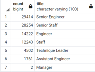

# Pewlett-Hackard-Analysis
# OVERVIEW
## Purpose
The purpose of this analysis is to help Bobby, a Pewlett Hackard RH analyst, to create an employee database in order to find the answer to next questions:
Who will be retiring the next few years?
Hoy many positions the organization will need to fill

## Results
Analyzing the results of the database, these findings were made:
- From all the organization, we can identify a big number of retirement candidates, as shown below. The total is 90,398 employees next to retirement.

    

- The number of candidates that are eligible for a mentorship is very small, and there are not enough candidates for all the available positions. We can see it in the next table:

    

- We can identify from the information above, for example, that there are not new candidates to fill the manager positions, neither to cover completely the open positions of the other departments.

- The department with more retirement candidates is development and the one with less retirement candidates is Finance, as shown below:

    

## Summary
1.	How many roles will need to be filled as the “silver tsunami” begins to make an impact?

    The total of roles that must be replaced are 90,398 as shown before, with the development and production departments with the bigger number of retirement candidates.

    

2.	Are there enough qualified, retirement-ready employees in the departments to mentor the next generation of Pewlett Hackard employees?

    There´s enough employees to mentor the next generation, per department the number of employees available for mentorship are the next, with a total of 1,708 employees, barely a 1.87% of the grand total of retirement candidates. As shown below.

    

